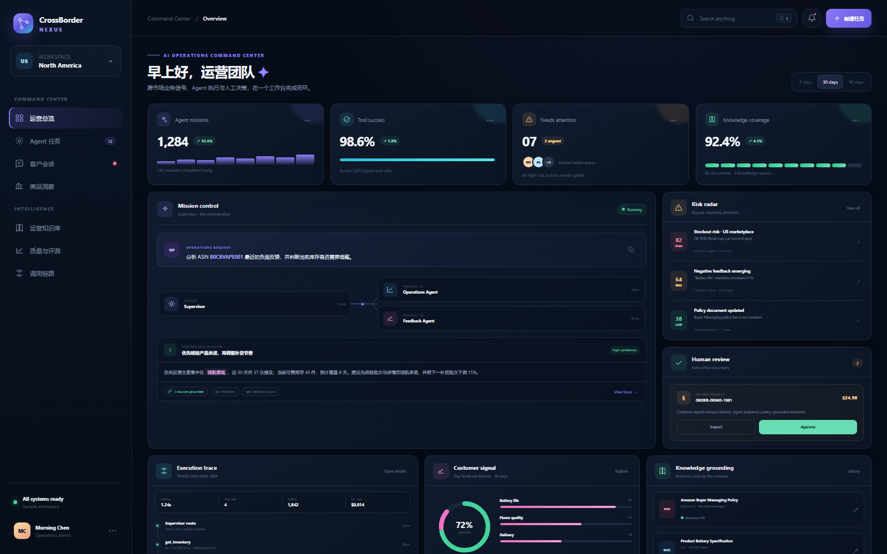
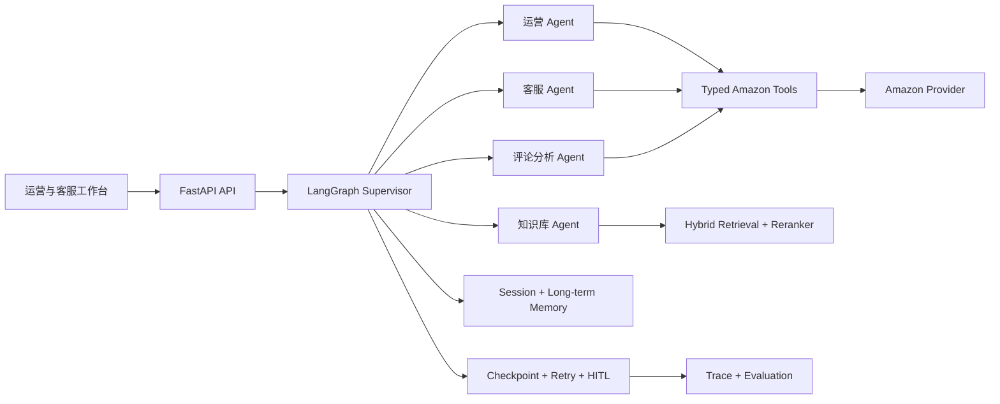

  
  <h1>CrossBorder Nexus</h1>
  
<strong>跨境电商多智能体运营平台</strong>

  
让运营分析、客户服务、企业知识与高风险决策在同一条 Agent 链路中协作。

  

    
    
    
    
    
  

  

    <a href="#核心能力">核心能力</a> ·
    <a href="#一次请求如何执行">执行架构</a> ·
    <a href="#可复现评测">评测体系</a> ·
    <a href="#本地查看">本地查看</a> ·
    <a href="docs/architecture.md">设计文档</a>
  

CrossBorder Nexus 面向跨境电商运营与客户服务团队，将商品、订单、库存、客户反馈和企业知识统一成可编排的业务能力。Supervisor 负责理解目标和安排执行，专业 Agent 通过类型化工具访问业务数据，最终以可追踪证据、人工确认和可复现评测闭合任务。

| 从业务问题到决策 | 从生成答案到可信证据 | 从自动执行到安全边界 |
| --- | --- | --- |
| 一个请求可同时调度运营、客服、知识库与评论分析 Agent | 每次回答保留工具轨迹、知识来源、耗时与质量信号 | 退款、赔付和发送消息等副作用进入人工确认，不由模型直接执行 |

## 核心能力

| 能力 | 关键实现 | 代码入口 |
| --- | --- | --- |
| 多 Agent 编排 | LangGraph `StateGraph` 组织 Supervisor、运营、客服、知识库和评论分析 Agent，支持结构化路由、串并行调度与结果聚合 | `backend/app/agents/` |
| 运营工具与数据分析 | Pydantic 定义商品、订单、库存和客户反馈工具契约，通过可替换 Provider 隔离 Mock 数据与正式 SP-API 适配器 | `backend/app/amazon_tools/` |
| 多渠道智能客服 | 统一网站、邮件和 Amazon 渠道消息，处理 FAQ、订单、物流和售后意图；低置信度或高风险操作转人工 | `backend/app/customer_service/` |
| RAG 跨境知识库 | PDF、Word 解析，递归切片，Metadata 过滤，关键词与向量混合召回、重排和引用溯源 | `backend/app/rag/` |
| 上下文与长期记忆 | 按 `user_id + session_id` 隔离会话，组合最近消息、历史摘要与 PostgreSQL 长期记忆 | `backend/app/memory/`、`backend/app/storage/` |
| 可靠性与评测 | Checkpoint、幂等键、指数退避、工具轨迹，以及路由、工具、完整轨迹、RAG 和异常恢复五层评测 | `backend/app/reliability/`、`evaluation/` |

## 一次请求如何执行

FastAPI 先校验身份、会话和业务参数，Supervisor 再生成结构化路由。简单请求进入单个专业 Agent，复合请求按依赖串行或并行执行；专业 Agent 只能通过类型明确的工具访问业务数据。知识库先做租户和文件范围过滤，再完成混合召回、重排和引用。证据不足、工具失败或涉及售后副作用时，系统停止自动执行并生成转人工任务。

## 代表性场景

- 运营分析：“检查 SKU `CB-POD-BLUE` 的库存，并分析 ASIN `B0CBVAPE001` 的负面反馈。”系统并行执行库存和评论分析，再聚合库存风险与产品改进建议。
- 客户服务：“订单 `ORDER-DEMO-1001` 到哪里了？”客服 Agent 查询订单和物流；退款、赔付等高风险操作生成待人工确认工单。
- 规则问答：“平台对买家消息有什么限制？”知识库 Agent 在指定租户和知识空间检索，只有证据充分时才回答，并返回文件、章节和原文来源。

## 可复现评测

评测不是只看最终答案，而是分别检查 Agent 的决策、动作、完整执行路径和失败恢复。固定数据集全部位于 `evaluation/datasets/`，每个失败用例都会保留预期值与实际值，便于回归定位。

| 层级 | 数据集 | 主要指标 | 解决的问题 |
| --- | ---: | --- | --- |
| 路由 | 100 条业务 Query | Exact Route Accuracy、Agent Set F1、Macro F1、执行模式准确率 | 是否分给了正确的 Agent |
| 工具 | 20 条调用样例 | Tool Name Accuracy、Argument Accuracy、Tool Call F1 | 工具选对后，参数是否也正确 |
| Agent 轨迹 | 12 条端到端任务 | Strict、Unordered、Subsequence、Handoff Accuracy | 中间步骤、工具顺序和人工转接是否合理 |
| RAG | 20 条问答样例 | Hit Rate、MRR、引用准确率、拒答准确率；可选 Ragas 指标 | 是否检索到正确证据并忠实回答 |
| 可靠性 | 16 条故障注入样例 | Recovery Pass Rate、Retry Budget、Duplicate Side Effects | 超时重试后是否恢复且不重复执行 |

本地确定性基线可统一执行 `python -m evaluation.run_all`，结果写入 [latest_report.json](evaluation/reports/latest_report.json)。`evaluation/thresholds.json` 定义最低质量门槛，任一关键指标退化都会让命令和 GitHub Actions 失败。Ragas 忠实度、上下文精确率和 LLM 轨迹裁判需要配置评审模型，未运行时保持 `null`，不会用其他项目的成绩或示例值替代。本项目的完整口径见 [评测设计](docs/evaluation.md)。

## 项目结构

| 目录 | 内容 |
| --- | --- |
| `backend/app/agents/` | Supervisor、结构化路由、专业 Agent 与 LangGraph 图 |
| `backend/app/amazon_tools/` | Amazon 工具契约、Mock Provider 和统一服务层 |
| `backend/app/customer_service/` | 渠道归一、客服意图、风险判断与人工转接 |
| `backend/app/rag/` | 文档解析、切片、混合检索、重排和引用 |
| `backend/app/memory/` | 短期上下文、历史摘要与长期记忆服务 |
| `backend/app/reliability/` | 重试、幂等、Checkpoint 和调用轨迹 |
| `evaluation/` | 五类数据集、评测脚本和统一报告入口 |
| `frontend/` | 无构建依赖的运营工作台预览 |
| `docs/` | 架构、需求、调研、模块映射和设计决策 |

## 本地查看

静态工作台无需安装依赖，直接用浏览器打开 `frontend/index.html`。如需验证后端工程，在 Python 3.11 以上环境安装开发依赖后，执行 `python scripts/verify_portfolio.py`、`pytest` 和 `python -m evaluation.run_all`。

默认 Provider 使用合成的 Amazon 商品、订单、库存和 Customer Feedback 数据，因此展示和本地评测不需要生产店铺凭证。正式接入时需要实现授权、区域端点、分页、限流和权限控制，并按照 Selling Partner API 当前文档校验字段。

## 设计边界

- 当前仓库提供完整的架构、接口契约、样例数据、评测集和展示界面；默认数据为可审查的合成样例。
- `AmazonProvider` 是正式适配器边界，`MockAmazonProvider` 是默认演示实现，不代表已经连接生产店铺。
- 只有由仓库内评测脚本生成并保留运行配置的报告才能作为本项目指标；`illustrative` 报告仅说明格式。
- 买家沟通严格限定为订单允许的消息操作，退款、赔付和发送消息等外部副作用需要人工确认。

## 文档

- [项目范围与成功标准](docs/project-brief.md)
- [需求和非目标](docs/requirements.md)
- [系统架构与请求链路](docs/architecture.md)
- [六项能力与代码映射](docs/module-mapping.md)
- [评测口径与结果边界](docs/evaluation.md)
- [调研结论](docs/research.md)
- [独立实现决策](docs/decisions/0001-independent-integration.md)

## 开源与许可证

CrossBorder Nexus 采用独立代码结构实现，相关项目用于架构、评测和产品设计参考。参考来源、许可证与代码复用边界记录在 [THIRD_PARTY_NOTICES.md](THIRD_PARTY_NOTICES.md)，本仓库代码使用 [MIT License](LICENSE)。如后续复制或实质改写第三方源文件，将同步保留原始路径、版本、版权声明和修改说明。
