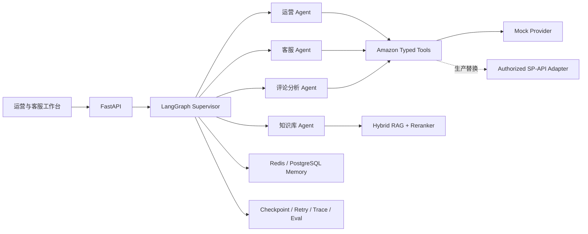

# CrossBorder Nexus 跨境电商多智能体运营平台

CrossBorder Nexus 是一个面向作品集展示的跨境电商多 Agent 运营平台，围绕运营分析、客户服务、企业知识库、上下文记忆和可靠性评测组织代码。项目采用 Python、FastAPI、LangGraph、PostgreSQL、pgvector 与 Redis 的工程结构，并以可替换的 Amazon Provider 协议隔离外部平台能力。

> 当前仓库定位为 Portfolio Demo：代码结构、接口契约、样例数据、评测集和设计文档完整；默认使用 Mock Amazon 数据，不声称已连接生产店铺，也不把示例报告中的空指标冒充真实线上结果。

## 项目亮点

| 能力 | 设计与实现 | 代码入口 |
| --- | --- | --- |
| 多 Agent 编排 | LangGraph `StateGraph` 组织 Supervisor、运营、客服、知识库与评论分析 Agent，支持结构化路由、串行/并行调度和结果聚合 | `backend/app/agents/` |
| 运营工具与数据分析 | Pydantic 定义商品、订单、库存、客户反馈与消息操作契约，统一封装 Provider 调用与工具轨迹 | `backend/app/amazon_tools/` |
| 多渠道智能客服 | 将网站等渠道消息归一为统一会话格式，识别 FAQ、订单、物流与售后意图；低置信度或敏感操作转人工 | `backend/app/customer_service/` |
| RAG 跨境知识库 | 支持 PDF、Word 解析、递归切片、Metadata 过滤、混合召回、重排及引用溯源 | `backend/app/rag/` |
| 上下文与长期记忆 | 以 `user_id + session_id` 隔离会话，组合最近消息窗口、历史摘要和 PostgreSQL 持久化模型 | `backend/app/memory/`、`backend/app/storage/` |
| 可靠性与评测 | 提供 Checkpoint、幂等键、指数退避、工具轨迹，以及路由、工具、RAG、异常恢复四类评测 | `backend/app/reliability/`、`evaluation/` |

## 系统架构

一次请求首先由 FastAPI 校验身份、会话和业务参数，再由 Supervisor 生成结构化路由。专业 Agent 只通过类型明确的工具访问业务数据，RAG 检索先执行租户及文件范围过滤，再完成召回、重排和引用；结果不足、平台动作不可用或售后风险较高时，系统返回转人工任务，而不是让模型自行执行外部副作用。

## 代表性场景

- “检查 SKU `CB-POD-BLUE` 的库存，并分析 ASIN `B0CBVAPE001` 的主要负面反馈。”Supervisor 将任务并行交给运营与评论分析 Agent，再聚合库存和反馈主题。
- “我的订单 `ORDER-DEMO-1001` 到哪里了？”客服 Agent 调用订单工具；需要联系买家时，先检查该订单当前允许的 Messaging Action，再进入人工确认。
- “平台对买家消息有什么限制？”知识库 Agent 在指定租户和知识空间中执行混合检索，证据充分才回答并返回文件、章节和原文来源。

## Amazon 集成边界

仓库中的商品、订单、库存和 Customer Feedback 数据均为合成样例。`AmazonProvider` 协议与 Pydantic 契约用于定义正式适配器边界，默认实现是 `MockAmazonProvider`。生产环境需要另外实现授权、区域端点、角色权限、分页、限流与重试，并根据 Selling Partner API 当前文档校验字段。

买家沟通不是任意私信：设计为先按订单查询平台允许的消息操作，再由人工确认发送。评论分析示例采用 Customer Feedback 的主题、趋势与片段语义，不宣称能够通过 SP-API 任意抓取全部原始评论。

## 评测设计

`evaluation/datasets/` 提供可审查的固定数据集：100 条路由样例、20 条工具调用样例、20 条 RAG 样例和 16 条故障恢复样例。对应脚本分别检查路由准确率、工具名称与参数、检索命中/拒答行为，以及重试和幂等恢复。

`evaluation/reports/example_report.json` 只定义报告结构，其状态明确标记为 `illustrative`，没有预填 95%、91.9% 或 90% 等未经本仓库实际运行得到的成绩。完成真实模型与 RAGAS 评测后，才应把报告改为 `measured`，并同时保存模型版本、数据集版本、基线和运行时间。

## 目录结构

| 目录 | 内容 |
| --- | --- |
| `backend/app/agents/` | Supervisor、路由、专业 Agent 与 LangGraph 图 |
| `backend/app/amazon_tools/` | Amazon 工具契约、Mock Provider 和统一服务层 |
| `backend/app/customer_service/` | 渠道消息、客服意图和人工转接 |
| `backend/app/rag/` | 文档解析、切片、检索、重排与引用 |
| `backend/app/memory/` | 短期上下文、摘要和长期记忆服务 |
| `backend/app/reliability/` | 重试、幂等和调用轨迹 |
| `evaluation/` | 数据集生成器、四类评测脚本和报告格式 |
| `frontend/` | 无构建依赖的静态工作台预览 |
| `docs/` | 架构、需求、调研、模块映射和设计决策 |

## 本地查看

静态工作台无需安装依赖，直接用浏览器打开 `frontend/index.html` 即可查看产品界面。若需要验证 Python 工程结构，可在 Python 3.11 以上环境安装项目的 `dev` 依赖，然后执行 `python scripts/verify_portfolio.py` 与 `pytest`。

Docker 相关文件用于说明交付形态。复制 `.env.example` 为 `.env` 后可作为后续联调起点，但本仓库不以“所有生产依赖已部署”作为展示前提。

## 文档导航

- [项目范围与成功标准](docs/project-brief.md)
- [需求和非目标](docs/requirements.md)
- [系统架构与请求链路](docs/architecture.md)
- [六项能力与代码映射](docs/module-mapping.md)
- [评测口径与结果边界](docs/evaluation.md)
- [调研结论](docs/research.md)
- [独立整合决策](docs/decisions/0001-independent-integration.md)

## 来源与许可证

本仓库是独立实现，不是将多个项目源码机械拼接后重新署名。设计参考、许可证和复用边界记录在 [THIRD_PARTY_NOTICES.md](THIRD_PARTY_NOTICES.md)；当前仓库代码使用 [MIT License](LICENSE)。后续如复制或实质改写第三方源文件，必须补充原始路径、提交版本、版权声明和修改说明。
