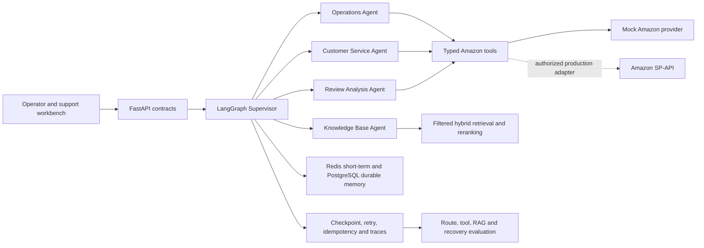

# Architecture

## System view

## Request flow

1. FastAPI validates the typed request and creates or accepts a `request_id`.
2. Conversation context is isolated by `user_id` and `session_id`.
3. The Supervisor emits a structured route with one or more specialists and a serial/parallel mode.
4. Specialists call deterministic typed services. The model is never allowed to invent an external side effect.
5. RAG requests apply tenant and optional file filters before retrieval, fusion, reranking, and citation creation.
6. Specialist results and traces are aggregated into one response.
7. Low-confidence, missing-evidence, restricted-message, and after-sales operations produce a human handoff instead of an autonomous external action.

## Six resume capabilities mapped to code

| Capability | Main implementation |
| --- | --- |
| Multi-agent orchestration | `backend/app/agents/graph.py`, `router.py`, `specialists.py` |
| Operations tools and analytics | `backend/app/amazon_tools/`, `sample_data/` |
| Multi-channel customer service | `backend/app/customer_service/`, `frontend/` |
| RAG knowledge base | `backend/app/rag/` |
| Context and long-term memory | `backend/app/memory/`, `backend/app/storage/models.py` |
| Reliability and evaluation | `backend/app/reliability/`, `evaluation/` |

## Data and permission boundaries

- `tenant_id` is required for knowledge retrieval and durable-memory records.
- `user_id` plus `session_id` isolates short-term conversation context.
- Amazon buyer messaging is order-scoped and availability-scoped. An operator confirmation is required by design before an outbound operation.
- Tool effects use `request_id` plus an operation fingerprint for idempotency.
- Secrets live in environment variables and are absent from sample data and traces.

## Demo versus production

| Area | Included demo | Production replacement |
| --- | --- | --- |
| LLM routing | Typed deterministic router | Structured-output model with the same schema |
| Amazon | Local JSON provider | Authorized SP-API transport, role checks, rate-limit handling |
| RAG | In-memory filtered hybrid scorer | pgvector embeddings, PostgreSQL FTS/BM25, model reranker |
| Memory | In-process reference service and SQL models | Redis session store and PostgreSQL repositories |
| Checkpoint | LangGraph memory saver | PostgreSQL/Redis checkpointer with retention policy |
| Observability | Typed trace schema | OpenTelemetry exporter and dashboards |
